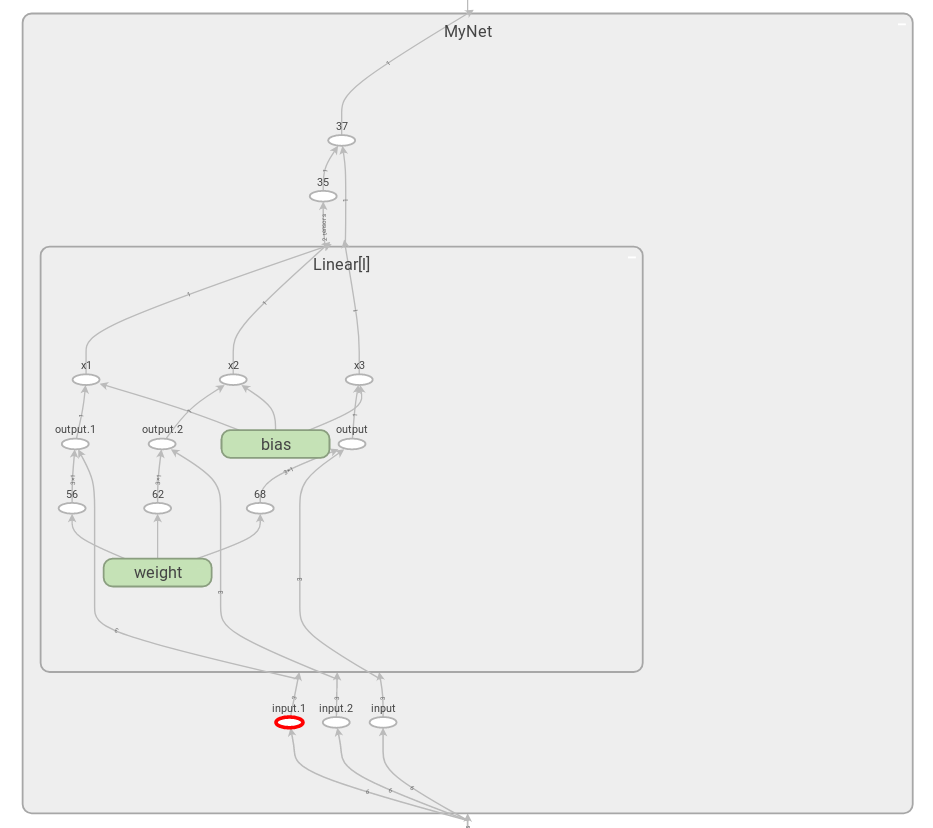
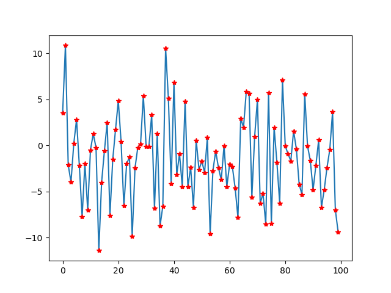
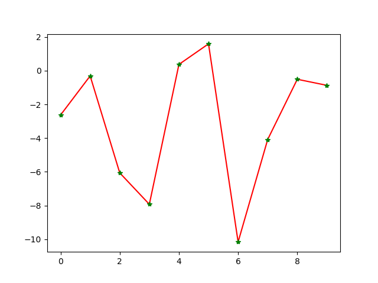
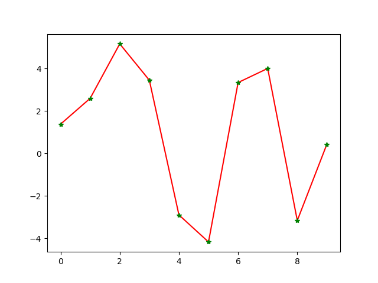
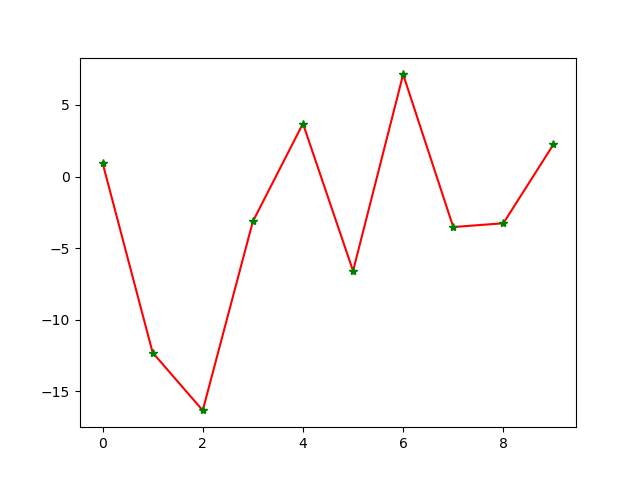

# 尝试重复使用神经网络层


[这是一个空箱子](https://aaeghijlnz.github.io/)
********
> 搭建网络
```python
class MyNet(nn.Module):
    def __init__(self): 
        super(MyNet, self).__init__()
        self.l = nn.Linear(3,1)
    def forward(self,x):
        x1 = self.l(x[0:3])
        x2 = self.l(x[3:6])
        x3 = self.l(x[6:9])
        return x1+x2+x3
```
> 可视化网络

```python

from tensorboardX import SummaryWriter
dummy_input = (torch.zeros(10,9),)
with SummaryWriter(comment='LinearInLinear') as w:
    w.add_graph(MyNet(), dummy_input, True)
```
在终端输入`tensorboard --logdir ./runs`

目前我只在linux下tensorboardX的examples里面成功画出了网络结构，不知道为何程序在其他地方不显示结果
*******************
> 训练与测试

* 样本生成
    `y = 2*x1 + 5*x2 - 8*x3`
    
    
```python
x = np.random.rand(1000,9)
y = np.zeros(1000)
for i in range(1000):
    y[i] = 2*x[i,0] + 5*x[i,1] - 8*x[i,2] +\          
            2*x[i,3] + 5*x[i,4] - 8*x[i,5] +\           
            2*x[i,6] + 5*x[i,7] - 8*x[i,8]
```
* 训练
    （略）
    
    
* 测试1  数据同训练样本
```python
x = np.random.rand(10,9)
y = np.zeros(10)
for i in range(10):    
    y[i] = 2*x[i,0] + 5*x[i,1] - 8*x[i,2]+\            
            2*x[i,3] + 5*x[i,4] - 8*x[i,5] +\           
            2*x[i,6] + 5*x[i,7] - 8*x[i,8]
x = torch.from_numpy(x).float()
y = torch.from_numpy(y).float()
x, y = Variable(x),Variable(y)yy = np.zeros(10)
for i in range(10):    
    yy[i] = net1(x[i])
print(yy)
plt.figure()
plt.plot(y,'r')
plt.plot(yy,'g*')
```


* 测试2  输入三维数据，仅用网络的层预测
```python
x = np.random.rand(10,3)
y = np.zeros(10)
for i in range(10):    
    y[i] = 2*x[i,0] + 5*x[i,1] - 8*x[i,2]
x = torch.from_numpy(x).float()
y = torch.from_numpy(y).float()
x, y = Variable(x),Variable(y)yy = np.zeros(10)
for i in range(10):    
    yy[i] = net1.l(x[i])
print(yy)
plt.figure()
plt.plot(y,'r')
plt.plot(yy,'g*')
```


* 测试3  输入15维数据，重新组织了网络结构
```python
x = np.random.rand(10,5)
y = np.zeros(10)
for i in range(10):    
    y[i] = 2*x[i,0] + 5*x[i,1] - 8*x[i,2]+\            
            2*x[i,3] + 5*x[i,4] - 8*x[i,5]+\           
            2*x[i,6] + 5*x[i,7] - 8*x[i,8]+\
            2*x[i,9] + 5*x[i,10] - 8*x[i,11]+\
            2*x[i,12] + 5*x[i,13] - 8*x[i,14]
x = torch.from_numpy(x).float()
y = torch.from_numpy(y).float()
x, y = Variable(x),Variable(y)yy = np.zeros(10)
for i in range(10):    
    yy[i] = net1.l(x[i,0:3]) +net1.l(x[i,3:6])+net1.l(x[i,6:9])+\
             net1.l(x[i,9:12])+net1.l(x[i,12:15])
print(yy)
plt.figure()
plt.plot(y,'r')
plt.plot(yy,'g*')
```

